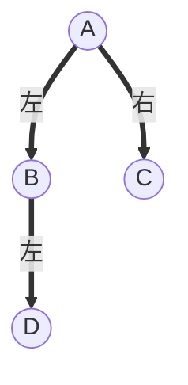

#  队列解决的问题
对于使用 <font color='red' size=5> 先进先出 </font>的特点的问题可以使用队列来进行求解。
## 1. 滑动窗口

<!-- 让表格居中显示的风格 -->
<style>
.center 
{
  width: auto;
  display: table;
  margin-left: auto;
  margin-right: auto;
}
</style>

<div class="center">

|       题目       |               题号               |
| :--------------: | :------------------------------: |
| 滑动窗口的平均值   | [41](file///../mianshiti_41.cpp) |
|   最近请求次数   | [42](file///../mianshiti_42.cpp) |

</div>

## 广度优先搜索（BFS）
使用二叉树的层序遍历编写的代码为：

```cpp
#include <iostream>
#include <queue>
#include <vector>
using namespace std;
vector<int> bfs(TreeNode* root){
    queue<TreeNode*> que;
    if(root == nullptr) return {}；
    vector<int> ans;
    que.push(root);
    while(!que.empty(){
        TreeNode* tmp = que.front();
        ans.push_back(tmp->val);
        que.pop();
        if(tmp->left){
            que.push(tmp->left);
        }
        if(tmp->right){
            que.push(tmp->right);
        }
    }
    return ans;
}
```
当笔试题中出现 <font color = 'red' size = 5>层</font> 相关的问题，可以使用队列<font color = 'blue' size = 5>广度优先</font>来解决问题。
##2. 树的层序
[面试题43 完全二叉树添加节点](file///../mianshiti_43.cpp)
<style>
.center 
{
  width: auto;
  display: auto;
  margin-left: auto;
  margin-right: auto;
}
</style>

<div class="center">


</div>
使用队列的先入先出特点，最终将节点：<font color='red' size = 6> B C D</font> 放在队列中 <font color='red' size = 4> (因为队列中存储的就是左右子树不满的情况)</font> 并且队列中的剩余元素就是用来存储未满节点的指针的。

> 注意：在存储节点到队列中的时候，必须先判断左节点是否有的情况，比如  **B的左节点为D** 。   

[面试题44 二叉树中每层的最大值](file///../mianshiti_44.cpp)
while 中一次计算整层的最大值；  使用 `int size = que.size()` 。


