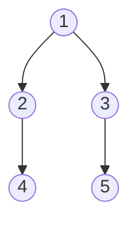

#树
##二叉树剪枝
 [剑指offerII](file//../mianshiti_47.cpp)
###方法一：
使用后序遍历方法进行修改得到，先一直遍历，然后再往回走的时候就一直判断时候为叶子节点值为 0， 如果是的花就删除操作，否则就返回原来的结点指针。
```cpp
    TreeNode* fun(TreeNode* root){
        if(root == nullptr) return nullptr;
        root->left = fun(root->left);
        root->right = fun(root->right);
        if(root->val == 0 and root->left == nullptr and root->right == nullptr){
            return nullptr;
        }
        return root;
    }
 ```
[剑指 Offer II 048. 序列化与反序列化二叉树](file///../mianshiti_48.cpp)

最简单的序列化过程就是使用前序遍历，然后对其反序列化的过程就是使用后序遍历的递归操作即可。但是在反序列化的操作中需要注意结点在数组中的位置。

[剑指 Offer II 049. 从根节点到叶节点的路径数字之和](file///../mainshiti_49.cpp)

使用 <font color = "red" size = 4.5>后序遍历</font> 方法进行修改得到,前面有两种处理情况，
1. 一种是到达叶子结点了（左右儿子都是空）就需要进行计算当前的路径值；
2. 一种是到达的是只有一个左孩子或者是只有一个右孩子，这个时候就可能出现的情况是传进来的可能是一个空指针。



## 二叉树的遍历
### 前序遍历
#### 递归实现
```cpp
void preOrder(TreeNode* root){
    if(root == nullptr){
        return;
    }
    cout << root->val <<endl;
    preOrder(root->left);
    preOrder(root->right);
}
```
#### 迭代实现
```cpp
void PreOrder(TreeNode* root){
    stack<TreeNode*> stk;
    stk.push(root);
    while(!stk.empty()){
        TreeNode* tmp = stk.top();
        stk.pop();
        cout << tmp->val << endl;
        if(tmp->right) stk.push(tmp->right);
        if(tmp->left) stk.push(tmp->left);
    }
}
```

### 中序遍历
#### 递归实现
```cpp
void inOrder(TreeNode* root){
    if(root == nullptr){
        return;
    }
    inOrder(root->left);
    cout << root->val <<endl;
    inOrder(root->right);
}
```
#### 迭代实现
```cpp
void inOrder(TreeNode* root){
    stack<TreeNode*> stk;
    stk.push(root);
    while(!stk.empty()){
        while(stk.top()->left != nullptr){
            stk.push(stk.top()->left);
        }
        while(!stk.empty()){
            TreeNode* tmp = stk.top();
            stk.pop();
            cout << tmp->value << " ";
            if(tmp->right != nullptr){
                stk.push(tmp->right);
                break;
            }
        }
    }
    cout << endl;
}
```
### 后续遍历

#### 递归实现

```cpp
void postOrder(TreeNode* root){
    if(root == nullptr){
        return;
    }
    postOrder(root->left);
    postOrder(root->right);
    cout << root->val <<endl;
}
```
#### 迭代实现
使用两个栈来实现。当然也可以使用一个栈实现，但是对于二叉树节点还需要添加一个判断条件。
```cpp
void postOrder(TreeNode* root){
    stack<TreeNode*> stk1;
    stack<TreeNode*> stk2;
    stk1.push(root);
    while(!stk1.empty()){
        stk2.push(stk1.top());
        TreeNode* tmp = stk1.top();
        stk1.pop();
        if(tmp->left){
            stk1.push(tmp->left);
        }
        if(tmp->right){
            stk1.push(tmp->right);
        }
    }
    while(!stk2.empty()){
        cout << stk2.top()->value << " ";
        stk2.pop();
    }
    cout << endl;
}