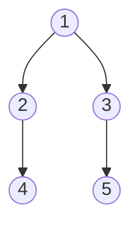

#树
##二叉树剪枝
 [剑指offerII](file//../mianshiti_47.cpp)
###方法一：
使用后序遍历方法进行修改得到，先一直遍历，然后再往回走的时候就一直判断时候为叶子节点值为 0， 如果是的花就删除操作，否则就返回原来的结点指针。
```cpp
    TreeNode* fun(TreeNode* root){
        if(root == nullptr) return nullptr;
        root->left = fun(root->left);
        root->right = fun(root->right);
        if(root->val == 0 and root->left == nullptr and root->right == nullptr){
            return nullptr;
        }
        return root;
    }
 ```
[剑指 Offer II 048. 序列化与反序列化二叉树](file///../mianshiti_48.cpp)

最简单的序列化过程就是使用前序遍历，然后对其反序列化的过程就是使用后序遍历的递归操作即可。但是在反序列化的操作中需要注意结点在数组中的位置。

[剑指 Offer II 049. 从根节点到叶节点的路径数字之和](file///../mainshiti_49.cpp)

使用 <font color = "red" size = 4.5>后序遍历</font> 方法进行修改得到,前面有两种处理情况，
1. 一种是到达叶子结点了（左右儿子都是空）就需要进行计算当前的路径值；
2. 一种是到达的是只有一个左孩子或者是只有一个右孩子，这个时候就可能出现的情况是传进来的可能是一个空指针。

